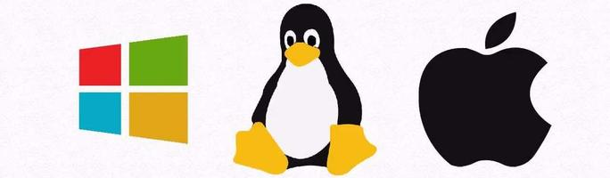

 
  

  &#xa0;

<h1 align="center">Soluções para Sistemas Operacionais</h1>

  

  

  

  <a href="#dart-sobre">Sobre</a> &#xa0; | &#xa0; 
  <a href="#rocket-tecnologias">Tecnologias</a> &#xa0; | &#xa0;
  <a href="https://github.com/Pedrinhonitz/solutions/tree/master/Windows">Windows</a> &#xa0; | &#xa0;
  <a href="https://github.com/Pedrinhonitz/solutions/tree/master/Linux">Linux</a> &#xa0; | &#xa0;
  <a href="https://github.com/Pedrinhonitz/solutions/tree/master/MacOs">MacOs</a> &#xa0; | &#xa0;
  <a href="https://github.com/Pedrinhonitz" target="_blank">Autor</a>

 

## :dart: Sobre ##

Um repositório de soluções para sistemas operacionais é uma plataforma online que reúne uma variedade de recursos, ferramentas, dicas e exemplos para auxiliar desenvolvedores e usuários na resolução de problemas relacionados a sistemas operacionais. Esses repositórios servem como um hub central para informações valiosas, abrangendo uma ampla gama de sistemas operacionais, desde Windows e macOS até diversas distribuições de Linux.

## :rocket: Tecnologias ##

As seguintes ferramentas foram utilizadas neste projeto:

- [Windows](https://www.microsoft.com/pt-br/windows/)
- [Linux](https://github.com/torvalds/linux)
- [MacOs](https://www.apple.com/br/)

 
Feito por <a href="https://github.com/Pedrinhonitz" target="_blank">Pedrinhonitz</a>

&#xa0;

<a href="#top">Voltar ao topo</a>